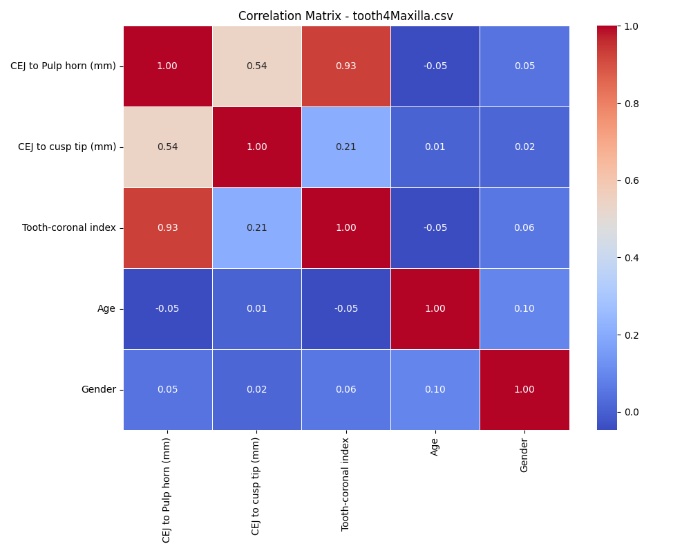
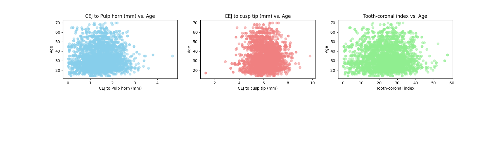

# PulpData: Dental Pulp Data PreProcessing

Welcome to the PulpData repository! This project focuses on preprocessing and analyzing dental pulp data, with the aim of extracting valuable insights from the dataset.

## Overview

Dental pulp data often contains critical information related to patients' oral health. This repository provides a set of data preprocessing and analysis techniques to harness this information effectively. The project includes the following key components:

### 1. Summary Statistics

We start by calculating and visualizing essential summary statistics for the dataset. This includes measures like mean, median, standard deviation, minimum, and maximum for relevant numeric columns. These statistics give us an initial understanding of the central tendencies and spreads in the data.

### 2. Tooth Count Analysis

Understanding tooth counts can be vital in dental research. We analyze and visualize tooth count data to gain insights into the distribution and frequency of different tooth numbers within the dataset.

### 3. Correlation Analysis

Correlation analysis helps identify relationships between variables. We calculate the correlation matrix between numeric features, including "CEJ to Pulp horn (mm)," "CEJ to cusp tip (mm)," and "Tooth-coronal index," and target variables like "Age" and "Gender." This analysis helps us identify which features are most strongly associated with the targets.

Furthermore, analysis for each file was conducted for deep analysis.

#### Correlation Matrix for tooth3Mandible.csv:

#### Correlation Matrix for tooth3Maxilla.csv:

#### Correlation Matrix for tooth4Mandible.csv:

#### Correlation Matrix for tooth4Maxilla.csv:

#### Correlation Matrix for tooth5Mandible.csv:

#### Correlation Matrix for tooth5Maxilla.csv:

#### Correlation Matrix for tooth6Mandible.csv:

#### Correlation Matrix for tooth6Maxilla.csv:

#### Correlation Matrix for tooth7Mandible.csv:

#### Correlation Matrix for tooth7Maxilla.csv:

#### Correlation Matrix for tooth8Mandible.csv:

#### Correlation Matrix for tooth8Maxilla.csv:

### 4. Scatterplots

Scatterplots provide a visual way to assess relationships between numeric features and target variables. We create scatterplots to visualize these relationships, enabling us to detect trends, patterns, and potential outliers in the data. Scatterplots are generated for "CEJ to Pulp horn (mm)," "CEJ to cusp tip (mm)," and "Tooth-coronal index" against both "Age" and "Gender."

## Getting Started

To replicate the analysis or explore the dental pulp data preprocessing techniques, follow these steps:

1. Clone this repository to your local machine.

2. Ensure you have the necessary Python libraries installed, such as pandas, matplotlib, seaborn, and Pillow (PIL).

3. Access the Jupyter Notebook or Python scripts within the repository to execute the data preprocessing and analysis steps.

4. Customize the code and visuals as needed for your specific dental pulp dataset.

## Contribute

We welcome contributions from the community! If you have ideas for improvements, additional analysis techniques, or visualizations, feel free to create a pull request or open an issue. Together, we can enhance our understanding of dental pulp data.

## License

This project is licensed under the MIT License - see the [LICENSE](LICENSE) file for details.

Thank you for your interest in the PulpData project. We hope it proves valuable for your dental research and data preprocessing needs.
